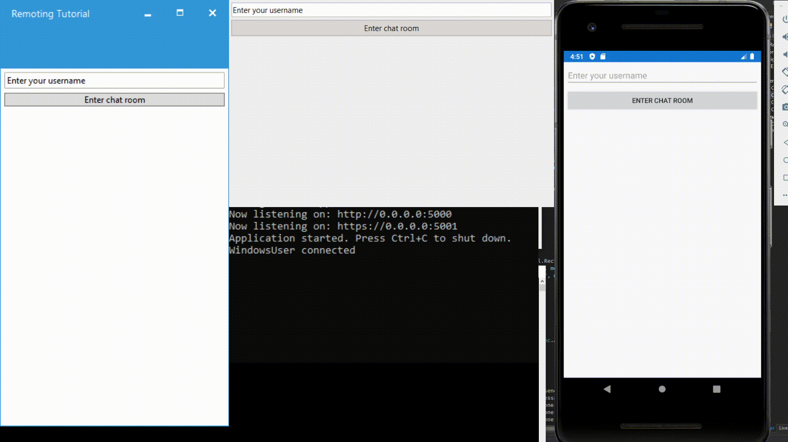

### Not yet finished. Don't look

This will serve as a sample codebase to show how to integrate SignalR Core in an F# Giraffe backend, and Fabulous Xamarin Forms Frontend with various cross platform clients

Meanwhile, here's what it looks like now:

